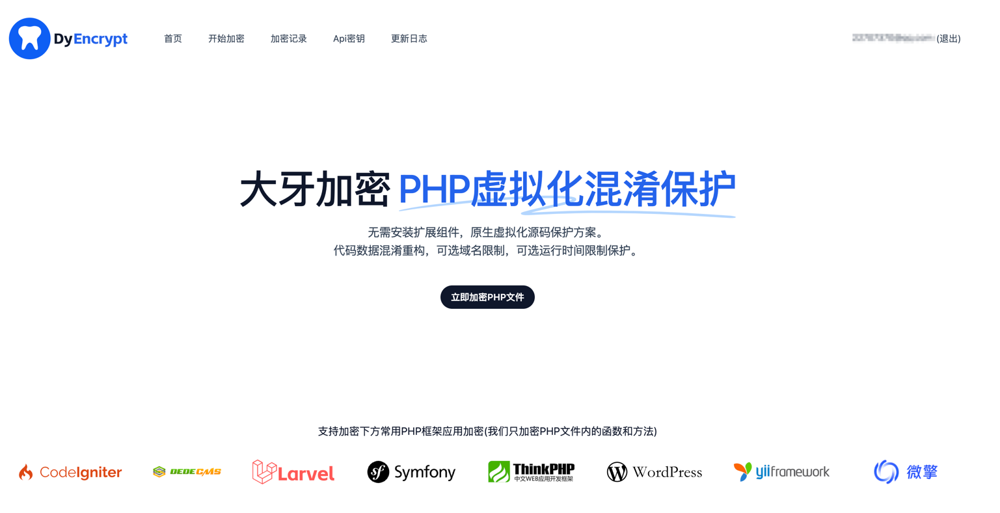
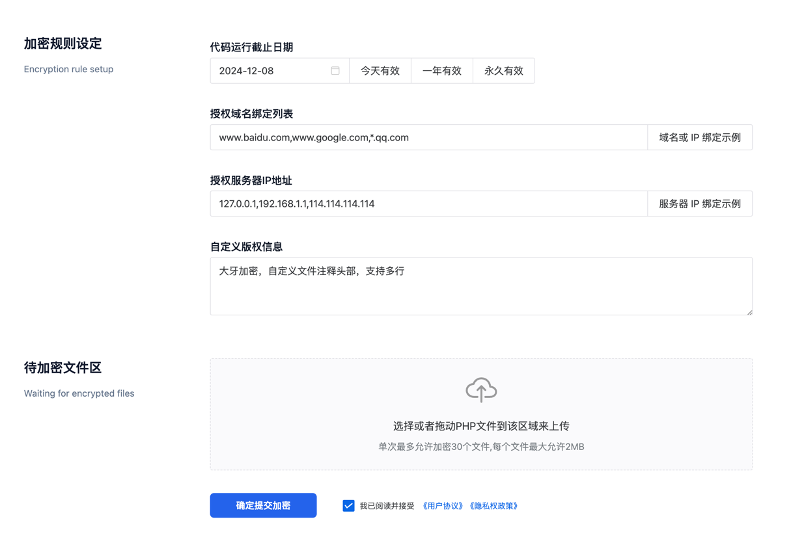

# 大牙加密,PHP虚拟化混淆保护

> 无需安装扩展组件，原生虚拟化源码保护方案。

> 代码数据混淆重构，可选域名限制，可选运行时间限制保护。

> 在线注册使用: 在线单文件免费加密无任何限制， 欢迎体验使用。


### 控制流打乱
```php
<!--在大牙PHP加密中,我们随机使用goto和switch打乱了部分源码-->

<!--原始PHP的代码-->
<?php
$a = "1";
$b = "2";
$c = "3";
echo $a, $b, $c;
?>

<!--使用goto打乱控制流后的代码-->
<?php
goto a;
ccc:
goto c;
aaa:
$a = "1";
c:
$c = "3";
echo $a, $b, $c;
goto over;
a:
goto bbb;
bbb:
$b = "2";
goto ccc;
over:
?>

<!--使用switch打乱控制流后的代码-->
<?php
$index=[20,13,52,83]; //case条件动态加密
$ip=0;
while (true){
    if ($ip>3) break;
    switch ($index[$ip]){
        case 52:
            $c = "3";
            break;
        case 83:
            echo $a, $b, $c;
            break;
        case 20:
            $a = "1";
            break;
        case 13:
            $b = "2";
            break;
        default:
            break;
    }
    $ip++;
}
```

### 变量名混淆
```php
<?php
//大牙PHP加密中,我们会将大部分变量名和方法名修改为随机二进制字符串
//我们默认会混淆变量名,类的私有变量名,私有函数名,虚拟机类名,局部变量等等

$name = "大牙";
$age = 18;
$sex = 1;
echo $name, $age, $sex;


/* 修改变量名或方法名 */
//变量名修改后,代码变得更不可读了,这是基础混淆手段
$did_v1676111358_0001 = "大牙";
$did_v1676111358_0002 = 18;
$did_v1676111358_0003 = 1;
echo $did_v1676111358_0001, $did_v1676111358_0002, $did_v1676111358_0003;
//动态修改为不可编辑的字符集变量名,只能拦住小白,会经过多层混淆
$did_v��� = "大牙";
$did_v��y� = 18;
$did_vj�슱 = 1;
echo $did_v���, $did_v��y�, $did_vj�슱;

/* 变量名或方法名二次存储 */
//这一步纯粹是让代码更不可读
//变量名修改后,我们将变量名存储到一个变量中,然后再使用这个变量统一管理了这个变量
$did_v1676111358 = [
    "0001" => "did_v1676111358_0001",
    "0002" => "did_v1676111358_0002",
    "0003" => "did_v1676111358_0003",
];
$did_v1676111358["0001"] = "大牙";
$did_v1676111358["0002"] = 18;
$did_v1676111358["0003"] = 1;
echo $did_v1676111358["0001"], $did_v1676111358["0002"], $did_v1676111358["0003"];

//更多的变量名混淆手段未展示...

```

### 反调试
```php
<?php
//反调试功能几乎不影响性能,可以放心使用
//此文件仅举例一些基础代码,大牙PHP加密还有更多的反调试技术,它们相互作用影响,随机插入,使得反调试更加难以检测

/*
 * 基础反调试原理
 */
//判断是否是命令行模式,如果是命令行模式,则视为被调试运行
php_sapi_name() == "cli" ? die() : '';

//判断服务器端环境变量是否存在,如果web相关环境变量不存在,则视为被调试运行
if (!isset($_SERVER["HTTP_HOST"]) && !isset($_SERVER["SERVER_ADDR"]) && !isset($_SERVER["REMOTE_ADDR"])) {
    die();
}

//如果遇到单步调试,会延迟一些时间,所以这里设置了一个时间阈值,超过则视为被调试运行
$dyc_start_time = microtime(true) * 1000;
/* some code */
if (microtime(true) * 1000 - $dyc_start_time > 100) {
    die();
}

//判断是否存在xdebug等调试插件,或其他调试工具,如果存在,则视为被调试运行
if (extension_loaded("xdebug")) {
    die();
}

//更多反调试技术未展示

/*
 * 整站反调试相互影响技术原理
 */
//文件A根据基础反调试原理,但是不进行die,而是将结果记录到全局变量中,或php会话中,或文件中,或$_SERVER变量中,或$_COOKIE变量中
global $dyc_anti_debug;
if (php_sapi_name() == "cli") {
    $dyc_anti_debug = true; //当此变量被定义为true时,将被视为被调试
}
//文件B,判断文件A中的全局变量$dyc_anti_debug的值是否是true,如果是,则视为被调试运行
global $dyc_anti_debug;
if ($dyc_anti_debug) {
    die();
}

/*
 * 随机插入技术原理
 */
//将反调试代码随机插入到文件中,并且反调试代码将随机执行,比如按某一个特定的时间,或特定的请求模式
//文件A,文件B,文件C,是N个不同的加密文件,会有2个虚拟机,这2个虚拟机代码内会随机插入反调试代码并随机执行.
//且文件A,和文件B,文件C,也将被随机插入反调试代码,并在加密时,反调试代码也会被编译为字节码,并随机执行.
// class DyVmPhp {
//   public function run(){
//      //some code
//      //可能的随机反调试代码区域
//      //some code
//      //可能的随机反调试代码区域
//      //some code
//   }
// }
$a = "a";
//可能的随机反调试代码区域
$b = "b";
//可能的随机反调试代码区域
$c = "c";

/*
 * 反调试暗桩,暗桩可不只下面的这一种哦
 */
//我们会使用明暗结合反调试,明则是检测到调试告知用户破解后的风险,暗桩则是随机的,不可预测的,让破解者无从下手
//当我们检测到反调试的时候,我们并不一定会结束php的执行,而是可能报错,或改变你的php执行逻辑.
//所以,尝试破解我们的大佬,请尽可能的完全逆向解密整站所有的代码,完整的去掉我们的暗桩,否则php执行逻辑可能该概率性错误哦
$number_100 = 100;
$number_200 = 200;
if ($dyc_anti_debug === true) { //插入的暗桩变量,或其他技术判断,如果当前是被调试运行,则执行暗桩逻辑
    //此逻辑是故意让他的结果错误的,从而使破解者的PHP代码最终发生逻辑错误
    if ($number_200 > $number_100) {
        echo "200 < 100"; //故意导致此错误的逻辑
    } else {
        echo "200 > 100"; //故意导致此错误的逻辑
    }
} else {
    // 正确的逻辑
    if ($number_200 > $number_100) {
        echo "200 > 100";
    } else {
        echo "200 < 100";
    }
}

//使用了更多的反调试技术我们并不会完全披露它们的技术原理
//我们会在不同的时间,使用不同的反调试技术,或者使用不同的反调试技术的组合,来达到最大的保护效果.

```


### 自定义字节码加密
```php
<?php

//大牙加密的核心是使用PHP再造了一个PHP的解释器,这个解释器实现了大部分PHP的语法.
//破解者如果需要破解大牙加密,就需要阅读虚拟机的执行流程
//然后再跟着虚拟机的执行流程去逆向重写加密代码,这复杂度不亚于重写开发一套
//大牙加密,每一个文件都可能有着一个不同的虚拟机执行机制,这样就可以让破解者更加难以逆向

/*
 * 举例一个简单的寄存器虚拟机, 加减乘除功能
 * 实际上虚拟机的完整实现是非常复杂的,这里只是简单的实现了一个寄存器虚拟机
*/

//原始PHP代码如下:
$a=11;
$b=22;
$c=33;
$d=44;
$a=$a+$b;
$c=$c*$d;
$a=$a-$c;
$d=$d/$a;
var_dump("原生的PHP执行结果:",$d); //输出结果为:float(-0.031007751937984496)


/*实现一个可以进行加减乘除的PHP虚拟机*/

// 定义操作码,操作码是指虚拟机可以执行的指令，例如加、减、乘、除等。
define('CMD_ADD', 1);
define('CMD_SUB', 2);
define('CMD_MUL', 3);
define('CMD_DIV', 4);
define('CMD_VARDUMP', 5);


//定义寄存器 寄存器是指虚拟机用来存储数据的位置，存储计算结果、动态变量值等。
$registers = array(
    'AX' => 11,
    'BX' => 22,
    'CX' => 33,
    'DX' => 44
);

// 虚拟机核心,解释器函数,用来执行操作码的.
// 该函数使用switch语句根据操作码执行相应的操作。每个操作将寄存器中的值进行修改，以便在执行下一个操作时使用。
function run($instructions) {
    global $registers;

    foreach ($instructions as $instruction) {
        $opcode = $instruction[0]; //操作码
        $op1 = $instruction[1]; //操作数
        $op2 = $instruction[2]; //操作数

        switch ($opcode) {
            case CMD_ADD:
                $registers[$op1] += $registers[$op2];
                break;
            case CMD_SUB:
                $registers[$op1] -= $registers[$op2];
                break;
            case CMD_MUL:
                $registers[$op1] *= $registers[$op2];
                break;
            case CMD_DIV:
                $registers[$op1] /= $registers[$op2];
                break;
            case CMD_VARDUMP:
                var_dump("PHP虚拟机执行结果:",$registers[$op1]);
                break;
        }
    }
}


//编写汇编程序,将汇编程序转换为虚拟机指令
$instructions = array(
    array(CMD_ADD, 'AX', 'BX'), //首先将BX寄存器的值加到AX寄存器中
    array(CMD_MUL, 'CX', 'DX'), //然后将DX寄存器的值乘到CX寄存器中
    array(CMD_SUB, 'AX', 'CX'), //接下来，它将CX寄存器的值从AX寄存器中减去
    array(CMD_DIV, 'DX', 'AX'), //最后将AX寄存器的值除以DX寄存器的值并将结果存储在DX寄存器中
    array(CMD_VARDUMP, 'DX', ''),  //输出DX寄存器的值，它应该是最终操作的结果:float(-0.031007751937984496)
);

run($instructions); //执行虚拟机

```

### 加密功能展示




### multi-language

###### Dy Encryption, PHP virtualization obfuscation protection

###### No need to install extension components, native virtualization source protection solution.

###### Code data confusion reconstruction, optional domain limit, optional runtime limit protection.

###### Online registration: online single file free encryption without any restrictions, welcome to experience the use.


